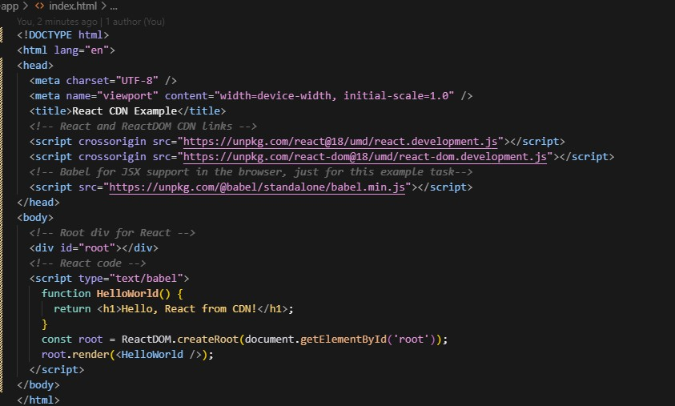
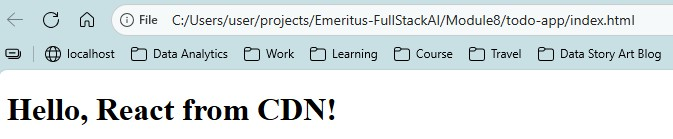

# NVM, React and Vite

Compiled  by Tan Bee Hoon (contact: tbeehoon@gmail)

This guide shows 

1. How to set up the environment for NVM, React and Vite.

2. Explain React Core Features and its advantages.

3. How to build a Todo App.

   

## 1. How to set up the environment for NVM, React, Vite 

### 1.1 Install NVM (Node Version Manager)

Download the latest `nvm-setup.exe` from the releases page: https://github.com/coreybutler/nvm-windows/releases

Run the installer, then open a new PowerShell/Command Prompt.

Verify:

```
nvm -version
```

> [!TIP]
>
> Avoid installing the “global” Node.js from nodejs.org if using NVM. 


### 1.2 Install Node.js via NVM and set a default

Install the version required (LTS recommended), then make it the default so new terminals pick it automatically.

In PowerShell/Command Prompt, do the following installation.

```
# Install latest LTS
nvm install --lts

# OR install a specific version
nvm install 20

# Use it now
nvm use 20

# Make it the default for all new shells
nvm alias default 20
```

In bash, do verification. 

```
# Verify
node -v
npm -v
```

> [!TIP]
>
> Using bash instead because PowerShell/Command Prompt may not have the execution right for node. 


### 1.3 Create a new React app with Vite

From any workspace folder in your terminal:

```
npm create vite@latest my-app -- --template react
# For TypeScript:
# npm create vite@latest my-app -- --template react-ts
```

Then install dependencies and run the dev server:

```
cd my-app
npm install
npm run dev
# Vite typically starts at http://localhost:5173
```

> [!TIP]
>
> Ctl-C to stop


### 1.4 Add Bootstrap to the React project

Install Bootstrap and its dependencies:

```
npm install bootstrap react-bootstrap
```

Import Bootstrap styles in src/main.jsx` (or `src/main.tsx` for TypeScript):

```
import 'bootstrap/dist/css/bootstrap.min.css'
```

Ready to use Bootstrap classes and React-Bootstrap components in app.

Example in `App.jsx`:

```
import Button from 'react-bootstrap/Button'

function App() {
return (
<div className="p-4">
    <h1>Hello, Bootstrap + React + Vite!</h1>
    <Button variant="primary">Click Me</Button>
</div>
)
}

export default App
```


### 1.5 Initialize Git

Version control the project using Git.

```
# Initialize a git repository
git init

# Add all project files
git add .

# Commit the files
git commit -m "Initial commit: setup React + Vite project"
```

To add to Github.

```
# Add remote 
git remote add origin https://github.com/username/my-app.git

# Push changes
git branch -M main
git push -u origin main
```

> [!TIP]
>
> In case identity need to be authenticated:
>

```
git config --global user.email "you@example.com"
git config --global user.name "Your Name"
```


### 1.6. Setup .gitignore

Add a `.gitignore` file in the root of the project to exclude files and folders not required in version control. Some examples of items to include:

```
# dependencies
/node_modules

# production build
/dist

# logs
npm-debug.log*
*.log

# environment variables
.env
.env.local
.env.*.local

# IDE/editor folders
.vscode/
.DS_Store

# Vite cache
.vite/
```

---


## 2. Explain React Core Features and its advantages

### 2.1 React Core Features

The following is a brief explanation of React’s core features: component-based architecture, Virtual DOM, and unidirectional data flow

#### **Component-Based Architecture**

- React applications are built using reusable, self-contained components.

- component encapsulates its own structure, logic, and style, making code modular and easier to maintain.

- Components can be nested, managed, and reused throughout the application.
- Components accept **props** (inputs) and manage internal **state**, then compose together like Lego bricks to form whole pages.
- This keeps concerns local and makes reuse easy.

#### **Virtual DOM**

- React uses a Virtual DOM, which is a lightweight copy of the actual DOM.

- When the state of an object changes, React updates the Virtual DOM first, then efficiently updates only the changed parts in the real DOM.
- When state changes, React computes the minimal set of real DOM updates via a diff (“reconciliation”) and applies them efficiently, often batching multiple updates. 

- This approach improves performance, especially in large and dynamic applications.

#### **Unidirectional Data Flow**

- Data in React flows in a single direction, from parent to child components via props.
- State changes trigger re-renders that propagate downward.
- This single direction makes data paths explicit and easier to trace. 

- This makes the data flow predictable and easier to debug, as changes in the application state are managed in a controlled way.

  

### 2.2 Advantages

These features collectively enable developers to build scalable, high-performance, and maintainable web applications.

- Maintainability: The component-based structure allows developers to break down complex UIs into smaller, manageable pieces, making code easier to read, test, and maintain.

- Performance: The Virtual DOM minimizes direct manipulation of the real DOM, resulting in faster updates and a smoother user experience.

- Predictability: Unidirectional data flow ensures that data changes are predictable and traceable, reducing bugs and making applications easier to debug.

- Reusability: Components can be reused across different parts of an application or even in different projects, speeding up development and ensuring consistency.


## 3. How to build a Todo App

The purpose: 

* **Set Up a Basic React Environment** 

* **Create and Render Functional Components**

* **Use JSX for Structuring Components**

### 3.1 Set Up a Basic React Environment

Prototype Task: 

a) Create an HTML file and include CDN links for React and ReactDOM. 

b) Add a <div> with an id of "root" in the HTML body. 

c) Write a simple React component inside a <script> tag and use ReactDOM.render() to render it to the page. 

The codes for the above tasks:

```
<!DOCTYPE html>
<html lang="en">
<head>
  <meta charset="UTF-8" />
  <meta name="viewport" content="width=device-width, initial-scale=1.0" />
  <title>React CDN Example</title>
  <!-- React and ReactDOM CDN links -->
  <script crossorigin src="https://unpkg.com/react@18/umd/react.development.js"></script>
  <script crossorigin src="https://unpkg.com/react-dom@18/umd/react-dom.development.js"></script>
  <!-- Babel for JSX support in the browser, just for this example task-->
  <script src="https://unpkg.com/@babel/standalone/babel.min.js"></script>
</head>
<body>
  <!-- Root div for React -->
  <div id="root"></div>
  <!-- React code -->
  <script type="text/babel">
    function HelloWorld() {
      return <h1>Hello, React from CDN!</h1>;
    }
    const root = ReactDOM.createRoot(document.getElementById('root'));
    root.render(<HelloWorld />);
  </script>
</body>
</html>
```

Screen captures for the above code:



Screen captures for the above in browser:




@Q.E.D.